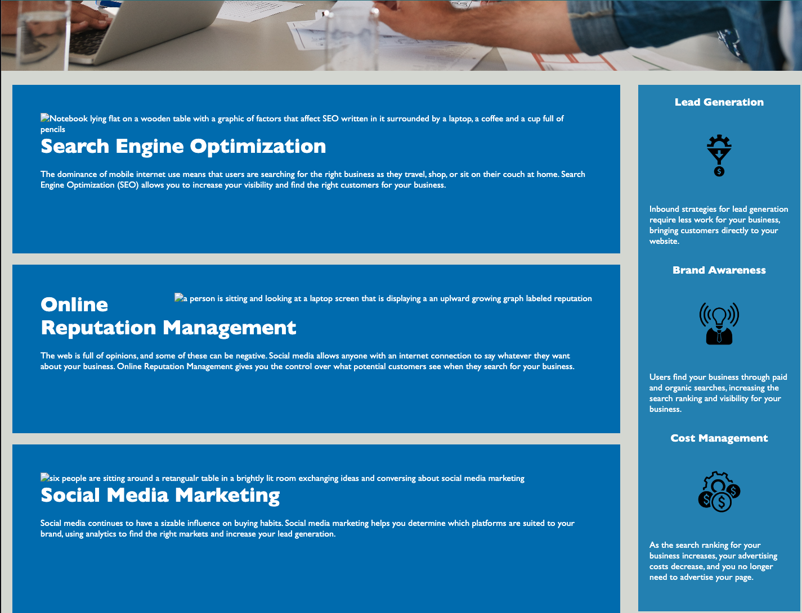
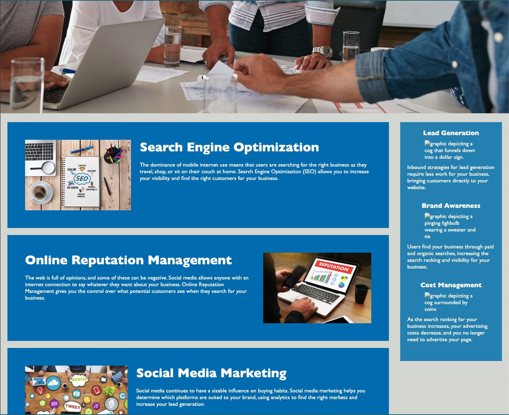

# WK1-CHAL 

## Description

Refactored code to include alt tags for images to increase accesibility. Consolidated a couple sections of CSS as well as added an id to search engine optimization link, which is now functioning. Changed 
 to the semantic HTML <header>.

Here is a screen shot of the accesibility changes

## Credits

Changes made by me, Rei Wolfson, wit help from tutor Katie Redford.

## License

Forgot to add a license when I created the repository. Will definitley do that for future challenges.

